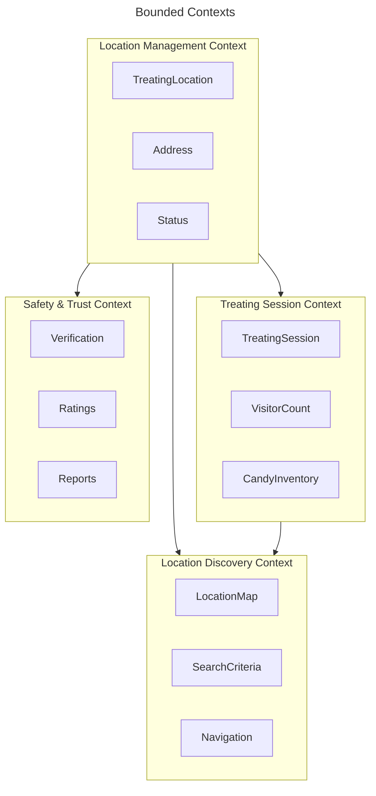

# Bounded Contexts

```mermaid
---
title: Bounded Contexts
---
graph TB
    subgraph Location["Location Management Context"]
        L1[TreatingLocation]
        L2[Address]
        L3[Status]
    end

    subgraph Session["Treating Session Context"]
        S1[TreatingSession]
        S2[VisitorCount]
        S3[CandyInventory]
    end

    subgraph Discovery["Location Discovery Context"]
        D1[LocationMap]
        D2[SearchCriteria]
        D3[Navigation]
    end

    subgraph Safety["Safety & Trust Context"]
        T1[Verification]
        T2[Ratings]
        T3[Reports]
    end

    Location --> Session
    Location --> Discovery
    Location --> Safety
    Session --> Discovery
```