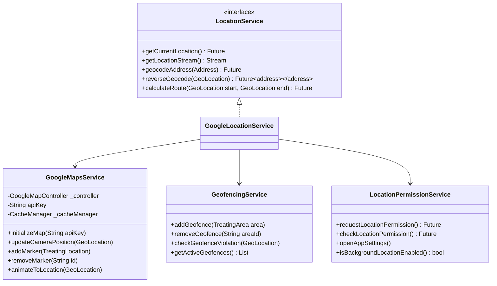

# Location Services Integration

## Service Interfaces

## Usage Optimization

### Caching Strategy
- Map tile caching
- Location data caching
- Geocoding results caching
- Route caching

### Rate Limiting
- Maximum requests per minute
- Batch processing for multiple locations
- Automatic retry with exponential backoff

### Data Usage Optimization
- Region-based data loading
- Progressive loading of map markers
- Compressed data transfer

## Privacy & Security

### Location Data Handling
- Data encryption at rest
- Secure API key storage
- Regular data purging
- Anonymized location tracking

### Permission Levels
1. Basic (While Using App)
   - View map
   - Search locations
   - Current location

2. Enhanced (Background)
   - Safety tracking
   - Geofencing
   - Route monitoring

3. Limited (No Location)
   - Manual address entry
   - Pre-planned routes
   - Static map view

## Cost Management

### API Usage Monitoring
- Request counting
- Usage alerts
- Cost allocation by feature
- Usage analytics

### Optimization Techniques
- Caching strategy
- Batch processing
- Request consolidation
- Regional data loading