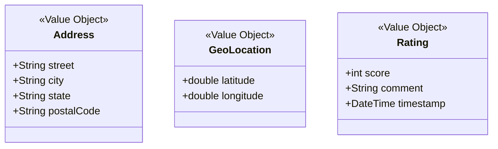
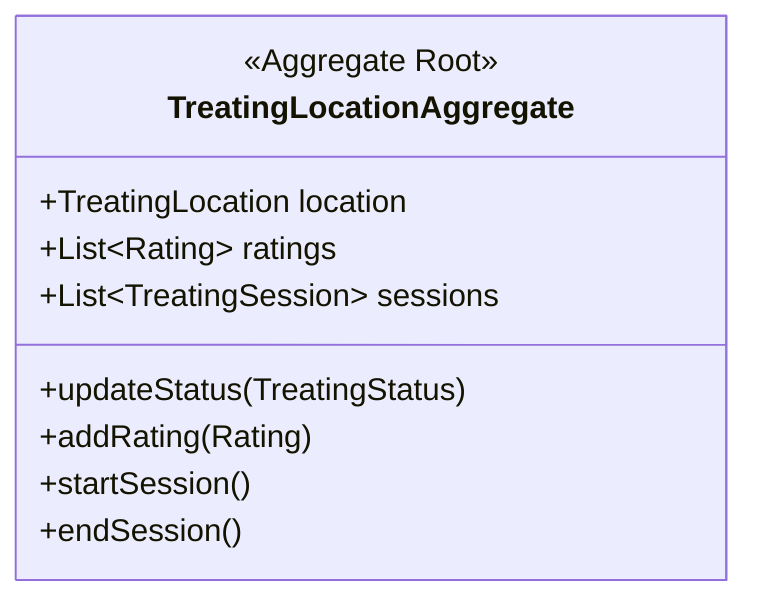

# Domain Model

```mermaid
classDiagram
    class TreatingLocation {
        +UUID id
        +Address address
        +String description
        +GeoLocation coordinates
        +TreatingStatus status
        +User owner
        +TreatingArea area
        +DateTime lastUpdated
        +SafetyRating safetyRating
        +ScareLevel scareLevel
        +String scareDescription
        +LocationType locationType
        +QueueStatus currentQueue
        +List~AccessPoint~ accessPoints
        +int estimatedDuration
        +updateStatus(TreatingStatus)
        +updateDescription(String)
        +updateScareLevel(ScareLevel, String)
        +updateQueueStatus(QueueStatus)
    }

    class ScareLevel {
        <<enumeration>>
        NotScary
        SlightlySpooky
        ModeratelyScary
        VeryScary
        Terrifying
        +int getValue() %% Returns 1-5
        +String getDescription()
    }

    class LocationType {
        <<enumeration>>
        Standard
        HauntedHouse
        WalkThrough
        Maze
        Exhibition
    }

    class AccessPoint {
        +UUID id
        +String name
        +GeoLocation coordinates
        +String instructions
        +AccessType type
        +bool isActive
        +DateTime lastUpdated
    }

    class AccessType {
        <<enumeration>>
        MainEntrance
        SideEntrance
        BasementEntrance
        GarageEntrance
        ExitOnly
    }

    class QueueStatus {
        +int currentLength
        +int estimatedWaitTime
        +QueueLength queueLevel
        +DateTime lastUpdated
        +List~QueueHistory~ history
        +updateQueue(int length, int waitTime)
        +calculateTrend()
    }

    class QueueLength {
        <<enumeration>>
        None
        Short
        Moderate
        Long
        VeryLong
        +int getEstimatedMinutes()
        +String getDescription()
    }

    class QueueHistory {
        +DateTime timestamp
        +int queueLength
        +int waitTime
        +calculateTrend()
    }

    class User {
        +UUID id
        +String name
        +String email
        +Role role
        +List~TreatingLocation~ locations
        +Family family
        +Country country
        +Language preferredLanguage
        +TimeZone timezone
        +List~PolicyConsent~ policyConsents
    }
    
    class AppSettings {
        +RegionalSettings regionalSettings
        +List~Country~ supportedCountries
        +List~Language~ supportedLanguages
        +PolicyEngine policyEngine
        +DeviceSettings deviceSettings
        +SyncSettings syncSettings
        +updateRegionalSettings(Country)
        +validatePolicyCompliance()
    }

    class DeviceSettings {
        +UUID deviceId
        +DeviceType type
        +String deviceName
        +DateTime lastSync
        +bool isPrimary
        +bool allowBackgroundSync
        +NotificationSettings notifications
        +OfflineSettings offline
    }

    class SyncSettings {
        +List~String~ enabledFeatures
        +SyncFrequency frequency
        +bool syncOnCellular
        +int maxOfflineDays
        +List~ContentType~ offlineContent
        +DateTime lastFullSync
        +handleSync()
        +resolveConflicts()
    }

    class OfflineSettings {
        +bool enableOfflineMode
        +StorageLimit mapCacheSize
        +StorageLimit imageCacheSize
        +List~OfflineArea~ savedAreas
        +DateTime lastCacheClean
    }

    class OfflineArea {
        +UUID id
        +String name
        +GeoLocation center
        +double radius
        +DateTime lastUpdated
        +List~TreatingLocation~ cachedLocations
        +bool isAutoUpdate
    }

    class Guardian {
        +UUID id
        +GuardianType type
        +List~ChildAccount~ children
        +VerificationStatus status
        +EmergencyContact contact
        +CustodySchedule schedule
    }

    class ChildAccount {
        +UUID id
        +String name
        +Age age
        +List~Guardian~ guardians
        +SafetySettings settings
        +LocationConsent locationConsent
        +List~Visit~ visitHistory
    }

    class SafetySettings {
        +GeofencingRules boundaries
        +List~EmergencyContact~ contacts
        +TrackingPreferences tracking
        +RouteRestrictions routes
        +List~TreatingArea~ allowedAreas
    }

    class TreatingStatus {
        <<enumeration>>
        Open
        Closed
        OutOfCandy
    }

    class Role {
        <<enumeration>>
        HomeOwner
        TrickOrTreater
        Guardian
        Administrator
    }

    class TreatingArea {
        +UUID id
        +String name
        +Boundary boundary
        +List~TreatingLocation~ locations
        +SafetyRating safetyRating
        +TimeWindow trickOrTreatTime
    }

    class TreatingGroup {
        +UUID id
        +String name
        +User organizer
        +List~User~ members
        +Route activeRoute
        +GroupStatus status
        +DateTime meetupTime
        +GeoLocation meetupLocation
        +List~GroupInvite~ pendingInvites
        +bool isPrivate
        +createInvite()
        +addMember(User)
        +removeMember(User)
        +updateRoute(Route)
    }

    class Route {
        +UUID id
        +User creator
        +TreatingGroup group
        +List~TreatingLocation~ plannedStops
        +RouteType type
        +SafetyRating rating
        +bool isShared
        +String shareCode
        +DateTime createdAt
        +DateTime startTime
        +EstimatedDuration duration
        +List~RouteCheckpoint~ checkpoints
        +shareRoute()
        +copyRoute()
        +mergeRoute(Route other)
    }

    class RouteCheckpoint {
        +UUID id
        +TreatingLocation location
        +int orderIndex
        +DateTime estimatedArrival
        +bool isCompleted
        +List~CheckpointNote~ notes
    }

    class GroupStatus {
        <<enumeration>>
        Forming
        Ready
        Active
        Completed
        Cancelled
    }

    class GroupInvite {
        +UUID id
        +TreatingGroup group
        +User invitedBy
        +String email
        +DateTime expiresAt
        +InviteStatus status
        +accept()
        +decline()
    }

    class RouteShare {
        +UUID id
        +Route route
        +String shareCode
        +DateTime createdAt
        +DateTime expiresAt
        +int useCount
        +SharePermissions permissions
        +bool isActive
    }

    class SharePermissions {
        +bool canEdit
        +bool canReshare
        +bool canInviteOthers
        +bool viewOnly
    }

    class Visit {
        +UUID id
        +User trickOrTreater
        +TreatingLocation location
        +VisitType type
        +DateTime timestamp
    }

    class TreatingSession {
        +UUID id
        +DateTime startTime
        +DateTime endTime
        +TreatingLocation location
        +int visitorCount
        +bool isActive
    }

    class Address {
        +String street
        +String city
        +String state
        +String postalCode
        +validate()
        +format()
    }

    class GeoLocation {
        +double latitude
        +double longitude
        +MapProvider provider
        +calculateDistance(GeoLocation)
        +toMapboxFormat()
        +toGoogleFormat()
        +toOSMFormat()
    }

    class MapProvider {
        <<enumeration>>
        OpenStreetMap
        GoogleMaps
        Mapbox
    }

    class MapConfiguration {
        +MapProvider primaryProvider
        +MapProvider fallbackProvider
        +CacheSettings cacheSettings
        +bool useHybridMode
        +int zoomLevel
        +updateProvider(MapProvider)
        +toggleHybridMode()
    }

    TreatingLocation "1" -- "1" Address
    TreatingLocation "1" -- "1" GeoLocation
    TreatingLocation "1" -- "1" TreatingStatus
    TreatingLocation "1" -- "1" User
    TreatingLocation "*" -- "1" TreatingArea
    TreatingSession "0..*" -- "1" TreatingLocation
    User "1" -- "1" Role
    Guardian --|> User
    ChildAccount --|> User
    User "1" -- "0..1" SafetySettings
    Route "*" -- "1" User
    Visit "*" -- "1" User
    Visit "*" -- "1" TreatingLocation
```

# Value Objects

```mermaid
classDiagram
    class Address {
        <<Value Object>>
        +String street
        +String city
        +String state
        +String postalCode
    }

    class GeoLocation {
        <<Value Object>>
        +double latitude
        +double longitude
    }

    class Rating {
        <<Value Object>>
        +int score
        +String comment
        +DateTime timestamp
    }
```

# Aggregates

```mermaid
classDiagram
    class TreatingLocationAggregate {
        <<Aggregate Root>>
        +TreatingLocation location
        +List~Rating~ ratings
        +List~TreatingSession~ sessions
        +updateStatus(TreatingStatus)
        +addRating(Rating)
        +startSession()
        +endSession()
    }
```