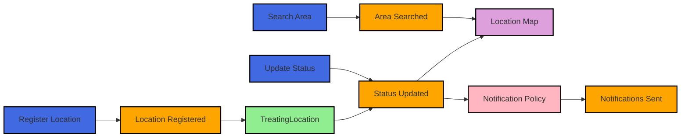

# Event Storming - Trick or Treat Finder

## Timeline View

## Domain Events (Orange)

### User Registration Flow
- HomeownerRegistered
- LocationVerificationRequested
- LocationVerified
- ProfileCompleted

### Location Management
- LocationRegistered
- StatusUpdated
- DescriptionUpdated
- LocationDeactivated

### Trick or Treating
- TreatingSessionStarted
- TreatingSessionEnded
- CandySupplyUpdated
- VisitorCountIncremented

### Search & Discovery
- AreaSearched
- LocationViewed
- RouteGenerated
- SafetyAlertTriggered

## Commands (Blue)

### Homeowner Commands
- RegisterLocation
- UpdateStatus
- UpdateDescription
- StartTreatingSession
- EndTreatingSession
- UpdateCandySupply

### Trick or Treater Commands
- SearchArea
- ViewLocationDetails
- GenerateRoute
- ReportSafetyConcern

## Aggregates (Green)

### TreatingLocation
- Properties:
  * LocationId
  * Address
  * Status
  * Description
  * CandySupply
  * SafetyRating
- Behaviors:
  * Update Status
  * Manage Sessions
  * Track Visitors

### TreatingSession
- Properties:
  * SessionId
  * StartTime
  * EndTime
  * VisitorCount
- Behaviors:
  * Track Visitors
  * Calculate Duration

## Policies (Pink)

- NotificationPolicy
  * Trigger: StatusUpdated
  * Action: Notify nearby trick-or-treaters

- SafetyPolicy
  * Trigger: SafetyAlertTriggered
  * Action: Review location status

- CrowdManagementPolicy
  * Trigger: VisitorCountIncremented
  * Action: Update wait times

## Read Models (Purple)

### LocationMap
- Active treating locations
- Status indicators
- Safety ratings
- Wait times

### TreatingHistory
- Past sessions
- Visitor statistics
- Popular times
- Rating history

## Hot Spots (Red)

1. **Safety Concerns**
   - How to verify locations?
   - What safety metrics to track?
   - When to trigger alerts?

2. **Privacy Issues**
   - What location data to show?
   - How to protect children's privacy?
   - Data retention policies?

3. **Scalability**
   - How to handle peak Halloween traffic?
   - Real-time updates at scale?
   - Geographic partitioning?

## Questions to Resolve

1. **Business Rules**
   - What defines an "active" treating location?
   - How long should sessions last?
   - What's the notification radius?

2. **Technical Decisions**
   - Real-time update mechanism?
   - Offline support strategy?
   - Location accuracy requirements?

3. **User Experience**
   - How to make status updates easy?
   - Navigation experience?
   - Accessibility considerations?

## Next Steps

1. Validate events and flows with stakeholders
2. Identify bounded contexts
3. Define core domain vs supporting domains
4. Create initial domain model
5. Plan first vertical slice