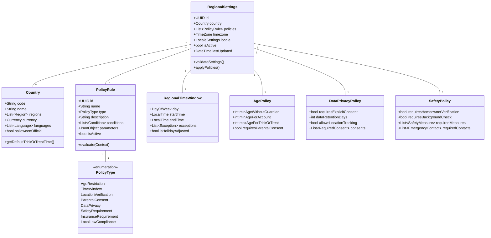

# Regional Policies and Settings

## Country-Specific Configurations

## Example Country-Specific Policies

### Denmark (Initial Target)
- Default trick-or-treat time: 17:00-20:00
- No specific age restrictions
- Minimal verification requirements
- GDPR compliance required
- Location sharing requires explicit consent
- Danish language support required

### United States
- Times vary by municipality
- Age restrictions common
- Background checks may be required
- COPPA compliance required
- State-specific privacy laws
- Insurance requirements possible

### United Kingdom
- Earlier trick-or-treat times
- Age guidance rather than restrictions
- GDPR compliance required
- Council-specific regulations
- Different terminology ("guising" in Scotland)

### Australia
- Seasonal adjustment (Spring)
- Daylight considerations
- Different safety requirements
- State-by-state variations
- Cultural sensitivity needed

## Implementation Considerations

### Basic Policy Structure
1. Default Global Policies
2. Country-Specific Overrides
3. Regional Modifications
4. Local Exceptions

### Key Policy Areas
1. Time Windows
   - Default trick-or-treat hours
   - Holiday adjustments
   - Seasonal considerations

2. Age Management
   - Minimum ages for activities
   - Guardian requirements
   - Account restrictions

3. Safety Requirements
   - Location verification
   - Background checks
   - Emergency contacts
   - Insurance needs

4. Privacy Compliance
   - Data collection
   - Consent requirements
   - Data retention
   - Location tracking

5. Cultural Adaptations
   - Terminology
   - Traditional practices
   - Local customs
   - Holiday significance

### Technical Implementation
1. Policy Engine
   - Rule evaluation
   - Policy inheritance
   - Override management
   - Version control

2. Localization
   - Language support
   - Time zones
   - Date formats
   - Currency handling

3. Compliance Tracking
   - Audit logging
   - Policy enforcement
   - Violation reporting
   - Compliance updates